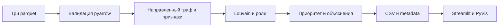

# Граф денег

Обновление: [загрузка CSV/Parquet и движущийся граф](docs/upload-and-motion.md). Собственные данные рассчитываются отдельно в `.user_runs`; для них добавлены явные параметры наблюдения в pipeline. Настройки примера хакатона не переносятся автоматически.

Локальный анализ наблюдаемой сети переводов. pipeline.py рассчитывает роли, кластеры и приоритеты; Streamlit + PyVis читает готовые CSV. Старые frontend/backend не участвуют в основном запуске.

## Установка Windows

Проверено на Python 3.12.10, Windows x64. Активация PowerShell не требуется:

```powershell
py -3.12 -m venv .venv
.venv\Scripts\python.exe -m pip install -r requirements.txt
```

В текущем рабочем каталоге используйте созданное проверочное окружение `.venv-ui`: прежняя `.venv` ссылается на недоступный Python.

## Запуск

```powershell
.venv\Scripts\python.exe run.py
```

Откройте http://127.0.0.1:8501. Скрипт пересчитывает parquet, ждёт успешного завершения и запускает Streamlit тем же Python. Ctrl+C останавливает дочерний процесс. Отдельные API/Node-серверы не нужны. Параметры: `--data`, `--out`, `--edges`, `--port`; пути по умолчанию от корня проекта.

Отдельный пересчёт и просмотр:

```powershell
.venv\Scripts\python.exe pipeline.py --data data_parquet --out out --edges-export data/edges.csv
.venv\Scripts\python.exe -m streamlit run app.py --server.address 127.0.0.1 --server.port 8501 -- --data out --edges data/edges.csv
```

Явные относительные пути pipeline CLI разрешаются от текущей папки; run.py передаёт абсолютные.

## Работа с интерфейсом

Поиск точного gid и кнопки глобального топа выбирают карточку и окружение, сбрасывая фильтры с уведомлением. Перейдите во вкладку «Граф и карточка» после выбора из топа/кластера. Неизвестный gid не меняет выбранный узел. Один или два шага обходятся в обе стороны, стрелки сохраняют src→dst. Режим всей сети сохраняется при изменении фильтров. Пустой список ролей даёт пустой граф.

Все узлы круглые. Цвет — роль, размер — priority_score (10–34 px), золотая обводка — seed, пунктирная — boundary. Доступны движение/пауза, плавное перестроение и показ всей сети. Полная сеть останавливается после стабилизации или через 6 секунд; малые подграфы затухают естественно. Открытие подробностей ставит физику на паузу. Полные gid в pandas/JSON/PyVis — строки. Клик по графу открывает подробности внутри iframe; карточка Streamlit выбирается поиском и топом.

Фильтры меняют видимость, но не выгрузки. Кэш учитывает SHA-256 файлов, кнопка обновления перечитывает результаты. Отсутствующие поля останавливают экран с точной командой пересчёта. vis-network встроен из установленного PyVis, внешних script/link нет; телеметрия Streamlit отключена. Браузерная проверка при отключённой внешней сети не выполнена.

## Файлы данных

Вход: data_parquet/nodes.parquet (gid, depth, is_seed), edges.parquet (src, dst, sum_kzt, n_tx, depth), transactions.parquet (src, dst, date, sum_kzt). Основной reader — pyarrow. Дополнительный CSV-вход требует полного набора и корректных типов.

| Выход | Поля |
|---|---|
| out/nodes_roles.csv | gid, role, role_score, cluster_id, priority_score, evidence |
| out/clusters.csv | cluster_id, n_nodes, n_seed, sum_kzt_internal, top_gids, hypothesis |
| out/top_nodes.csv | rank, gid, role, priority_score, why; топ-40 |
| out/node_metrics_full.csv | Полные метрики, explanation и четыре вклада приоритета |
| out/run_metadata.json | Статус, размеры, период, пороги, метод, время, предупреждения |
| data/edges.csv | Направленные рёбра для интерфейса |

CSV сохраняют десятичные gid без округления. Данные и архив предназначены для передачи организаторам хакатона, наружу не публикуются.

## Правила ролей и формулы

Ниже приведены параметры примера хакатона. Для загрузок глубина берётся из явно указанного профиля; при неизвестной глубине terminal отключён, достижимость seed считается без искусственного ограничения 4. Порог суммы и охват не предполагаются автоматически.

Порядок: изолят → coordinator → consolidator → distributor → transit → terminal → peripheral. При пересечении выбирается первое правило; дополнительные сигналы записаны в explanation. Role_score — эвристическая поддержка гипотезы, не вероятность виновности.

I/O — число входящих/исходящих контрагентов; V — вход KZT; B — направленная невзвешенная betweenness; S — прямые seed-соседи; R — число seed, достигающих узла по направлению за ≤4 шага. C=max(5,floor(q90 положительных I)), D=max(15,floor(q90 положительных O)), Q=q95 положительных B. В текущем расчёте C=5, D=15, Q=0.0013361804007553844.

| Роль | Условие | role_score |
|---|---|---|
| coordinator | S≥2 и B≥Q, Q существует | min(1, 0.5·min(S/4,1)+0.5·B/Q) |
| consolidator | I≥C, V>0 | 0.55·min(I/(2C),1)+0.45·min(R/4,1); boundary: максимум 0.65 |
| distributor | O≥D | 0.55·min(O/(2D),1)+0.45·min(out_tx/100,1) |
| transit | не seed/boundary, вход/выход >0, p=out_kzt/in_kzt в [0.8,1.2] | min(1, 1−abs(p−1)/0.4) |
| terminal | не seed, depth<4, V>0, O=0 | min(1, 0.55+0.45·min(V/max(Vmax,1),1)) |
| peripheral | остальные; изоляты обрабатываются первыми | 0.15; для изолята 0.20 |

Счёт округляется до 6 знаков. Нулевой вход означает отсутствующий pass-through («н/д»).

```text
priority = 0.40·weight(role)·role_score
         + 0.25·minmax(log1p(in_kzt))
         + 0.20·minmax(betweenness)
         + 0.15·minmax(min(n_seed_neighbors,5))
```

Веса: coordinator=1, consolidator=0.9, distributor=0.75, transit=0.35, terminal=0.25, peripheral=0.10. Minmax по всем узлам; при постоянном признаке 0. Равные приоритеты сортируются по gid. Louvain: seed=42; встречные веса суммируются в неориентированную пару. Внутренний оборот считается по исходным направленным рёбрам один раз.

## Подтверждённые результаты

Два полных прогона parquet→CSV: **10.007 и 8.891 секунды**, включая старт Python и публикацию. Три обязательных CSV побайтно совпали. 2248 узлов, 3119 рёбер, 4840 транзакций, 91 кластер. Роли: consolidator 51, transit 67, distributor 26, terminal 1071, coordinator 7, peripheral 1026.

**25 тестов прошли**: 6 pipeline, 5 UI, 3 launcher, 11 загрузок/пересчёта. Обновлённый сервер отвечает HTTP health 200. Визуальная проверка 1280/1440/1920 px, перетаскивание и скачивание через браузер не подтверждены: браузерный инструмент недоступен. Новые проверки: [upload-and-motion.md](docs/upload-and-motion.md). Предыдущая сдача: [verification.md](docs/verification.md), [измерения и SHA-256](docs/verification.json), [версии пакетов](docs/tested-environment.txt).

```powershell
.venv\Scripts\python.exe -m pip install -r requirements-dev.txt
.venv\Scripts\python.exe scripts/verify_release.py
.venv\Scripts\python.exe -m pytest tests/test_pipeline.py tests/test_ui.py tests/test_run.py tests/test_uploads.py -q -p no:cacheprovider
.venv\Scripts\python.exe scripts/package_release.py
```

Архив предыдущей сдачи: release/graf-deneg-submission.zip. Для включения последних изменений пересоберите его через scripts/package_release.py. Папки пользовательских загрузок не включаются.

## Архитектура



[Архитектура](docs/architecture.md), [SVG для слайда](docs/architecture.svg), [демо на 5 минут](docs/demo.md).

## Ограничения и масштабирование

Следующие числа и ограничения относятся только к примеру хакатона; для своих данных используйте профиль загрузки.

Depth=4: 444 boundary не доказывают конец потока. Вход seed неполон; 19 изолятов не имеют наблюдаемых переводов. Только внутрибанковские переводы от 5000 KZT: дробление ниже порога невидимо. Нет ground truth и клиентских атрибутов. Наблюдаемые суммы — не полный баланс; сумма по рёбрам может повторно учитывать те же деньги. Даты дневные, совпадение сумм не доказывает транзит тех же средств.

Для миллиона узлов: компактный/компилируемый граф (CSR/igraph), колоночные агрегаты Arrow/Polars, приближённые центральности, пакетная кластеризация, выдача подграфов/агрегированных слоёв. Глобальные PageRank/betweenness нельзя точно обновлять только у ближайших соседей без влияния на остальную сеть.

## Резервные исходники

Старый pqmini в _kit — ограниченный Linux fallback с системной libzstd, не основной Windows-reader. В запуск и архив он не входит; его декодер не сравнивался с pyarrow. reference/viewer_original.html в архиве сохранён как резерв: он использует CDN и не является автономным интерфейсом сдачи.
