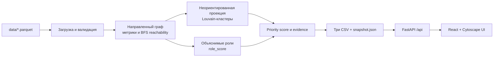

# Архитектура

Вычисления выполняются один раз CLI-пайплайном. HTTP-запросы читают готовый snapshot и не пересчитывают граф. UI использует тот же origin в production; при разработке Vite проксирует `/api` на порт 8000.