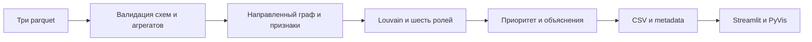

# Архитектура

`run.py` последовательно вызывает `pipeline.py` и Streamlit через `sys.executable`, передаёт абсолютные пути и не запускает UI при ошибке расчёта. API/Node-сервер не нужен.

Валидация проверяет весь набор входов, int64 идентификаторы, ссылки, суммы и количества. Граф содержит все узлы до расчёта метрик. Louvain работает по неориентированной проекции с суммой встречных весов; роли и приоритет считаются по направленным признакам.

Результаты готовятся во временном каталоге, проверяются и публикуются с резервным комплектом для отката. Маркер публикации останавливает загрузку UI во время замены файлов. Это локальный последовательный запуск, а не многопользовательская транзакционная БД; одновременные пересчёты в один out не поддерживаются.

Интерфейс читает CSV, не пересчитывает роли; gid передаётся в PyVis строками. Inline vis исключает CDN-скрипты; визуальная и сетевая проверка браузером остаются открытыми.

[SVG 1600×900 для слайда](architecture.svg). [Протокол проверки](verification.md).
