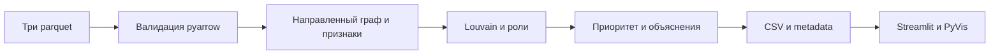

# Архитектура

run.py последовательно запускает неизменённый pipeline.py и Streamlit через sys.executable с абсолютными путями. Ошибка расчёта запрещает старт UI. Пайплайн проверяет схему, ссылки, суммы и число переводов, включает изоляты в граф, считает направленную невзвешенную betweenness и PageRank. Louvain работает по проекции с суммированием встречных весов. Правила ролей и приоритет записываются вместе с объяснениями.

ui/data.py валидирует готовый контракт и выбирает видимый подграф; роли не вычисляет. Хеш файлов инвалидирует кэш. app.py хранит выбранный строковый gid и режим в session_state, меняет их callbacks. ui/graph.py использует PyVis и собственный шаблон со встроенными ресурсами: численные gid в JavaScript не попадают. Детали клика остаются внутри iframe; карточка приложения выбирается поиском и топом. CSV отдаются целиком.

Ограничение публикации существующего pipeline: каталог out и отдельный edges.csv не являются одной атомарной транзакцией. Во время пересчёта лучше остановить UI; run.py запускает его только после успешного завершения. Пайплайн по условию задачи не изменялся.

Масштабирование описано в README. Рисунок для одного слайда: [architecture.svg](architecture.svg).
